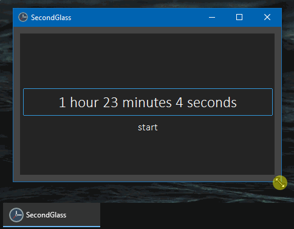
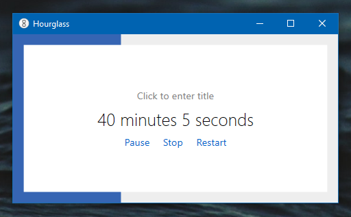

<h1>secondglass</h1>

A portable timer-application: simple yet efficient time management tool.

It was **hugely** inspired by [@dziemborowicz](https://github.com/dziemborowicz)'s 
[Hourglass](https://github.com/dziemborowicz/hourglass) app.

<h2>Table of Contents</h2>

- [Goals](#goals)
  - [What is Hourglass? click to (un)fold](#what-is-hourglass-click-to-unfold)
  - [What's wrong with Hourglass?](#whats-wrong-with-hourglass)
- [Features](#features)
- [How to use](#how-to-use)
- [What's inside](#whats-inside)
  - [My modules](#my-modules)
  - [Third party modules](#third-party-modules)
- [How to build](#how-to-build)
  - [Software requirements](#software-requirements)
  - [First run](#first-run)
  - [Regular `make` targets](#regular-make-targets)
- [Licensing](#licensing)

## Goals
**Why did I make it**:
- to get familiar with Python GUI toolkits (with `tkinter` in particular) to be able to use it in my other projects
- to make a proper substitution for [Hourglass](https://github.com/dziemborowicz/hourglass)

  
 <strong>What is Hourglass?</strong> Click to (un)fold.

### What is Hourglass? click to (un)fold

It's a countdown timer desctop GUI application for Windows;
written on C#; minimalistic in a Unix-way-ish sence.

It looks like this:

### What's wrong with Hourglass?
Nothing's wrong with it. It's an ammazing app. I've being using it for 3+ years.

Though, in my humble opinion, it maybe needs some slight optimization. Its downsides are:
- unreasonably high memory consumption: **70-180 MB**, depending on the size of the window I guess
- inefficient GPU usage: **up to 30% load** on GeForce RTX 2060
  - *like why it even needs GPU?*
    - it is used to produce a fancy window flickering background effect when the timer has rang

## Features

- a single-file portable app
- resizable window with adaptive UI
- you type the time duration in a textbox and press the `start`-button (or just <kbd>Enter</kbd>)
  - input examples:
    - `10` becomes: **10 minutes**
    - `123` or `123 m` or `123min` becomes: **2 hours 3 minutes**
    - `30s` or `30 s` or `30 sec` becomes: **30 seconds**
    - `1h 35m` becomes: **1 hour 35 minutes**
  - the last valid input is saved between sessions
- you can **pause**, **restart** or **abort** the timer by pressing `pause`, `restart` and `stop` buttons respectively
- when the timer expires:
  - the short dinging sound is played
  - the timer window pops up above all the over windows
- the progress bar is also displayed on a taskbar plate, so it's visible even when the app is minimized
- requires ≈ 20MB of RAM

## How to use

Windows 10 is required.

1. Download the executable named `secondglass.exe`, from the [latest release](releases/latest)
2. Run the executable

## What's inside

### My modules 
- `secondglass.timer` — the core-logics of the app (ui-agnostic)
- `secondglass.ui.console` — visualization in command line
- `secondglass.ui.tkbootstrap` — `tkinter`-powered UI
  - [see more on the event-model I use](secondglass/ui/README.md)
  - [see more on the window structure](secondglass/ui/tkbootstrap/README.md)
- `secondglass.progress` — working with Windows toolbar indicator

### Third party modules
- `tkbootstrap` — gives `tkinter` some attractive appearance
- `comtypes` — grants access to Windows API (to change window toolbar)
- `pyglet` — plays that dinging sound when the timer rings
- `pyinstaller` — packs everything together into a single executable

## How to build

### Software requirements
- [Python 3.11](https://www.python.org/downloads/)

- (optional) [Poetry](https://python-poetry.org)
- (optional) [make](https://en.wikipedia.org/wiki/Make_(software)) tool

### First run
1. Install the dependencies:
   - option 1 - if having both `make` and `Poetry`:  
     - in the project directory execute `make init`
   - option 2 - if only having `Poetry`: 
     - in the project directory execute `poetry install`
   - option 3 - if having none:
     - in the project directory create virtual environment and switch to it
     - execute `pip install -r requirements.txt`
2. Run the app: 
  - option 1: `make run`
  - option 2: `poetry run python -m secondglass`
  - option 3: `python -m secondglass`

### Regular `make` targets
- `make run` or `make` — run app with Python
- `make lint` — launching linters and formaters (`mypy`, `black`, `isort`, `flake8`)
- `make test` — run unit-tests
- `make build` — create an executable in a `build` folder

## Licensing
- this application is licensed under [MIT License](LICENSE)
- [the application icons](https://github.com/paomedia/small-n-flat) were created by [@paomedia](https://github.com/paomedia/) and are licensed under [CC0 1.0](https://github.com/paomedia/small-n-flat/blob/master/LICENSE)
- the application sounds belong to a variety of authors:
  - [LloydEvans09](https://freesound.org/people/LloydEvans09/)'s:
    - [Light wood](https://freesound.org/people/LloydEvans09/sounds/185846/) — under [CC 4.0](https://creativecommons.org/licenses/by/4.0/)
    - [Balsa hit 1.wav](https://freesound.org/people/LloydEvans09/sounds/186401/) — under [CC0 1.0](https://creativecommons.org/publicdomain/zero/1.0/)
    - [Wood spin](https://freesound.org/people/LloydEvans09/sounds/186993/)  — under [CC0 1.0](https://creativecommons.org/publicdomain/zero/1.0/)
    - [spray_can_rattle.wav](https://freesound.org/people/LloydEvans09/sounds/332001/)  — under [CC NC 4.0](https://creativecommons.org/licenses/by-nc/4.0/)
  - [ArtOrDie](https://freesound.org/people/ArtOrDie/)'s:
    - [Ding.wav](https://freesound.org/people/ArtOrDie/sounds/338148/) — under [CC 4.0](https://creativecommons.org/licenses/by/4.0/)
  - [michael_grinnell](https://freesound.org/people/michael_grinnell/)'s:
    - [Metalic_Ching_Keys_2.wav](https://freesound.org/people/ArtOrDie/sounds/338148/) — under [CC0 1.0](https://creativecommons.org/publicdomain/zero/1.0/)

