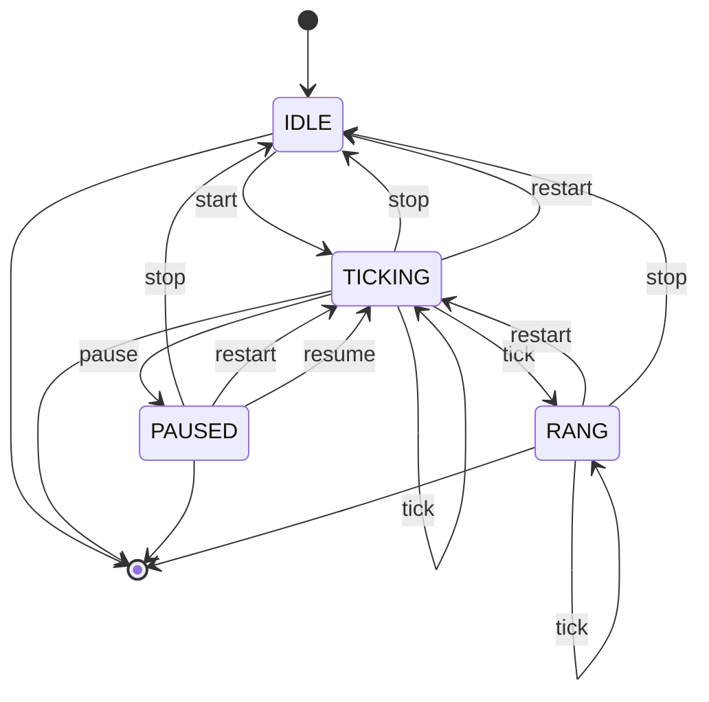
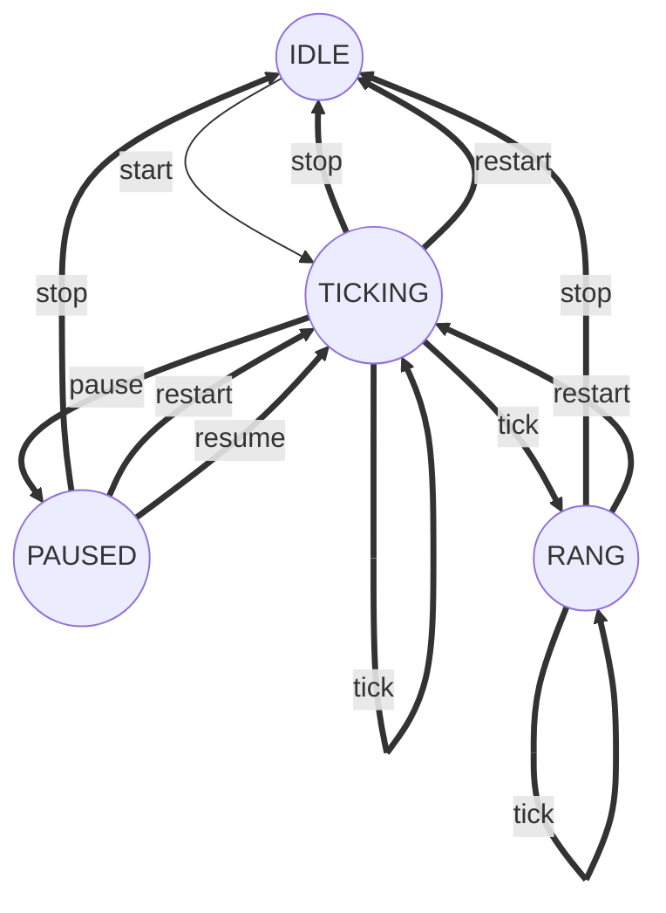

| State     | Actions available                           |
| --------- | ------------------------------------------- |
| `IDLE`    | `start`, `close`                            |
| `TICKING` | `tick`, `pause`, `stop`, `restart`, `close` |
| `PAUSED`  | `resume`, `stop`, `restart`, `close`        |
| `RANG`    | `tick`, `stop`, `restart`, `close`          |

