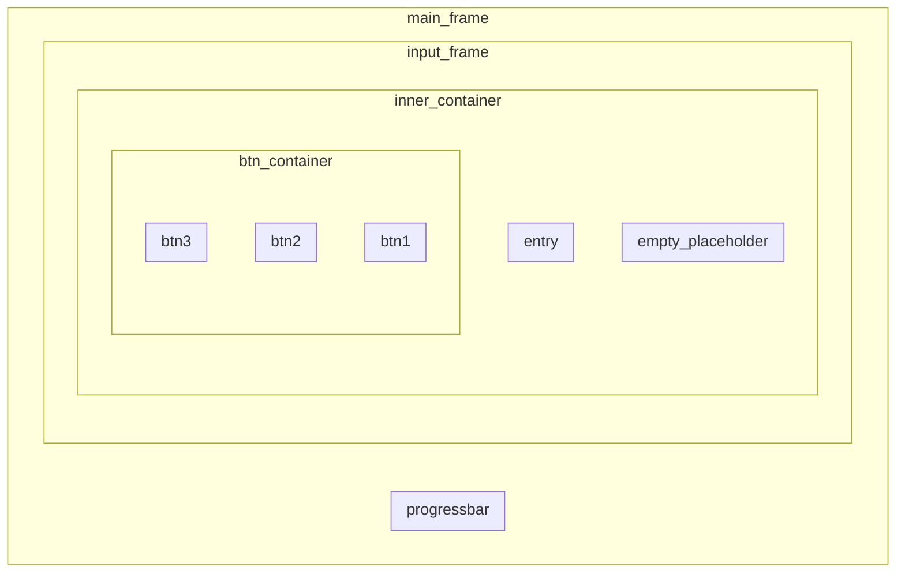

## Frame structure

## Legend

- `main_frame` — the root-frame of the window
- `progressbar` — the `Progressbar` control
  - positioned with `place` method on background
  - fills the entire frame
- `input_frame` — contains all the user input widgets
  - positioned with `pack` method
  - has padding
  - fills the entire frame, overlapping `progressbar`
- `inner_container` — keeps all widgets close to each other
  - is centered
  - fills only the `X` axis
- `empty_placeholder` — an empty `Label` widget — used for alignment
- `entry` — an `Entry` widget — used for both input and output
- `btn_container` — groups buttons together — never exceeds one line
- `btn#` — the `#`-th `Button` widget